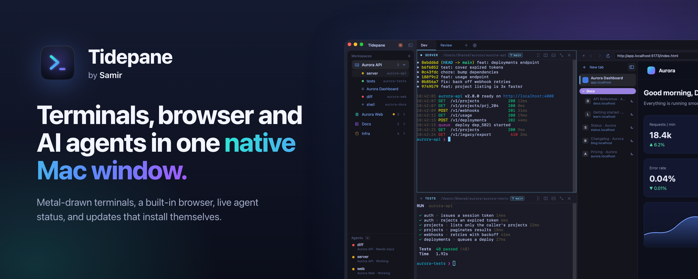
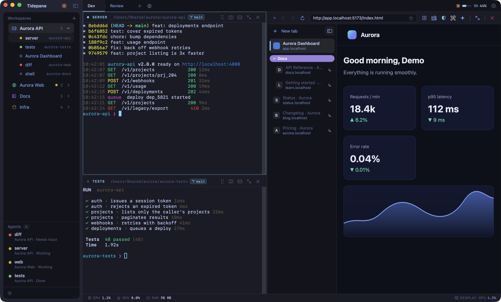
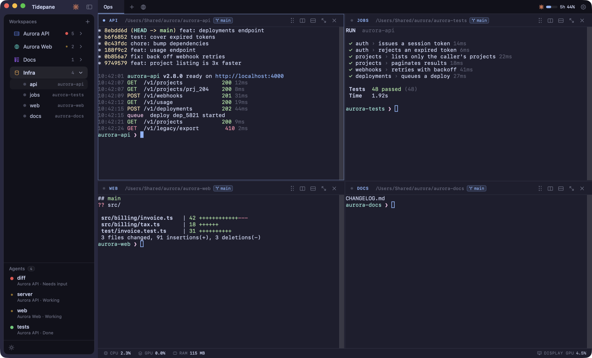
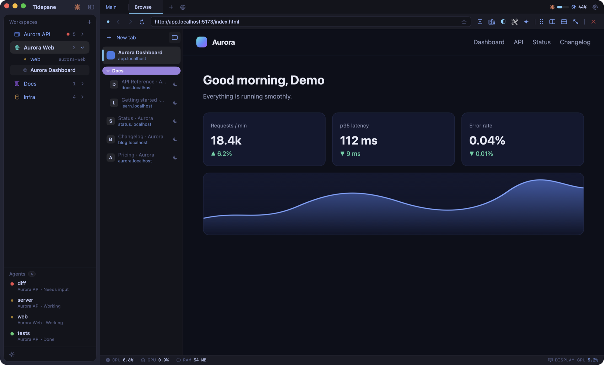
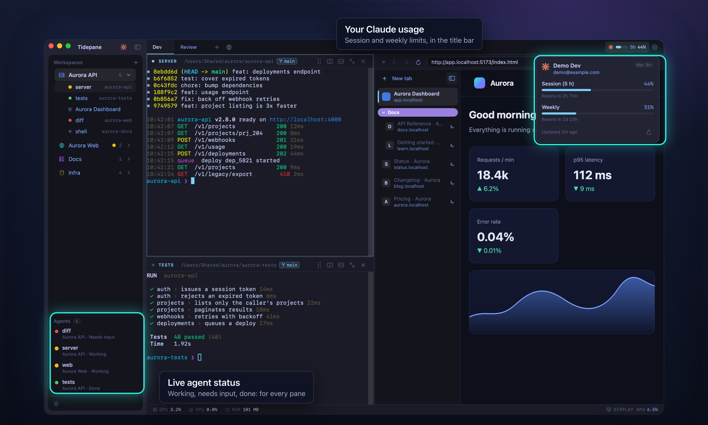
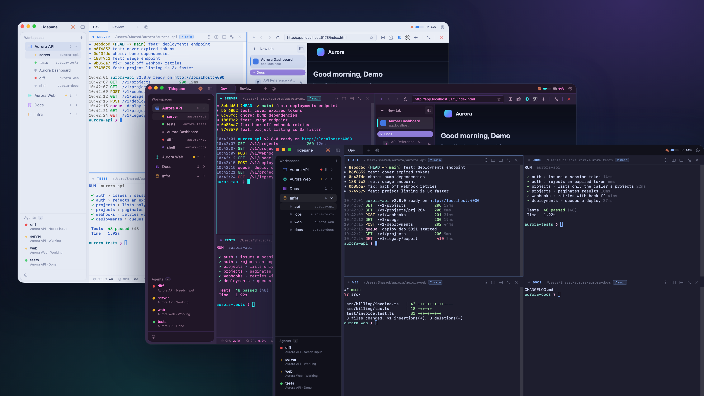
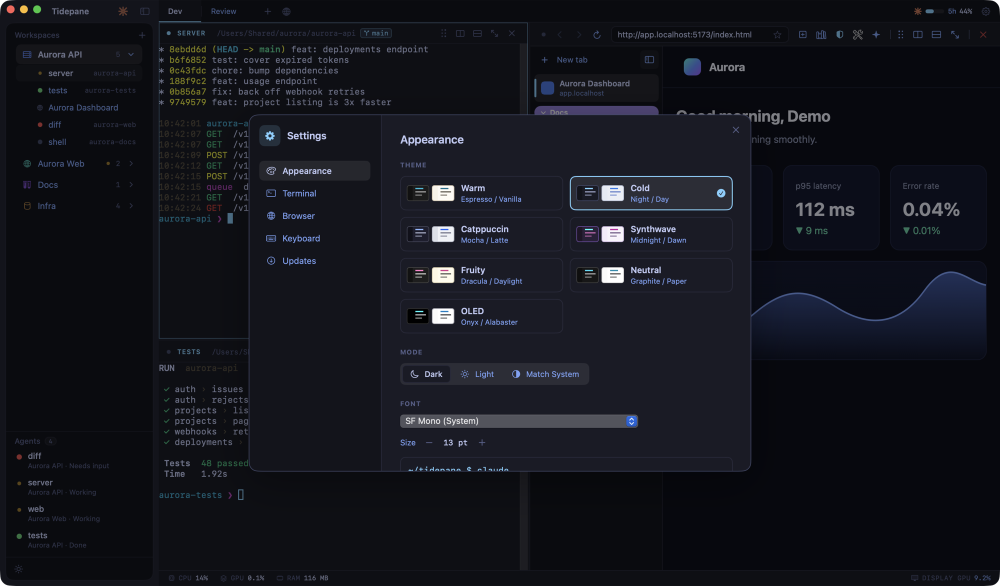

  

<h1 align="center">Tidepane</h1>

by <b>Samir</b>

  <b>Terminals, browser and AI agents in one native Mac window.</b> 
  Metal-drawn terminals that keep running, a browser built into your workspace, live status for your coding agents, and updates that install themselves.

  
  
  

  <a href="https://github.com/TermSpace-vibes/tidepane-releases/releases/latest"><b>⬇ Download for macOS</b></a>
  &nbsp;·&nbsp; <a href="#install">Install</a>
  &nbsp;·&nbsp; <a href="#shortcuts">Shortcuts</a>

 

  

## Why you'll like it

| | What you get |
|---|---|
| **One window for the whole job** | Run the server, the tests and the docs side by side, and open the page you are building next to them. No more hunting for the right window. |
| **Shells that survive** | Quit the app or install an update and your shells keep running in the background. Open it again and your terminals reattach. |
| **Built for AI coding agents** | See at a glance which pane is working, which needs your answer and which is done, and keep an eye on your Claude usage. |
| **Light on your Mac** | Terminals redraw only when something changes, so an idle window costs next to nothing. |
| **Always current** | Signed, one-click updates. Press a button, it reopens as the new version. |

## Workspaces, tabs and splits

Group your work into **workspaces**, each with its own **tabs**, and split any tab into as many panes as you like: right, down, or both. Drag a pane onto another to swap places, or maximize one when you need room. Your layout is saved and comes back exactly as you left it.

  

- Split right or down, drag to rearrange, maximize and restore
- Per-pane header with working directory and git branch
- SSH workspaces that use the hosts from your `~/.ssh/config`
- A small status bar showing the app's own CPU, GPU and memory use

## A browser that lives in your workspace

Open any page in a **browser pane** right next to your terminals. A vertical tab list keeps lots of pages tidy, with groups you can colour and collapse, and every tab shows its site so a long title never hides where it came from. Tabs you are not using go to sleep and wake when you click them.

  

- Vertical tabs with groups, bookmarks and history
- Ad blocking, including video ads on YouTube
- Downloads, find in page, zoom and private tabs
- Try a page at phone and tablet sizes, hard reload, or clear a site's data in a click
- Notices the address a dev server prints in a terminal (`Local: http://localhost:5173/`) and offers to open it

## Built for AI coding agents

If you work with **Claude Code**, Tidepane shows what every agent is doing without you switching panes: **Working**, **Needs input** or **Done**, right in the sidebar. A usage meter in the title bar shows how much of your session and weekly limits you have used, and the card behind it shows when they reset.

  

- Live agent badges for every pane, across all your workspaces
- Session and weekly usage from Claude Code's own figures
- **Optional:** let Claude Code use a browser pane you choose to share. It is off until you switch it on, shared one pane at a time, and tabs you mark private stay hidden from it. Password, card and one-time-code fields are hidden from it too

> **What it touches on your Mac:** to see agent status, Tidepane keeps a few clearly tagged hook entries in Claude Code's `~/.claude/settings.json`. They post to a port on your own machine. Everything else in that file is left as it was.

## Make it yours

Seven theme families, each with a dark and a light mode, or match the system. Pick your font and size, your default shell and your search engine.

  

  

## Shortcuts

| Action | Shortcut |
|---|---|
| Split right | `⌘D` |
| Split down | `⇧⌘D` |
| Maximize or restore a pane | `⇧⌘↩` |
| New browser tab | `⌥⌘T` |
| New browser pane | `⌥⌘B` |
| Close pane or tab | `⌘W` |
| Show or hide the sidebar | `⌘B` |
| Settings | `⌘,` |

## Install

1. Download the latest `.zip` from the [Releases page](https://github.com/TermSpace-vibes/tidepane-releases/releases/latest) and unzip it.
2. Drag the app into your **Applications** folder and open it.

**First launch.** The app is signed, but it is not yet notarized by Apple, so macOS asks you to confirm the first time. Control-click the app and choose **Open**, or go to **System Settings → Privacy & Security** and choose **Open Anyway**. You only do this once.

**Updating.** The app checks for new versions in the background. When one is ready an **Update** button appears in the sidebar. Click it and the app restarts as the new version; your terminals keep running.

**Requirements.** A Mac with Apple silicon (M1 or later) running macOS 14 or later. Intel Macs are not supported yet.

## Your data

Your workspaces, layouts, bookmarks and history are stored in a local database on your Mac. There are no accounts and no analytics. The only network traffic is the pages you open, their site icons and the check for updates.

 

Tidepane by Samir is an independent project. Claude and Claude Code are trademarks of Anthropic; Mac, macOS and Metal are trademarks of Apple Inc.
Neither company endorses or is affiliated with this app.

